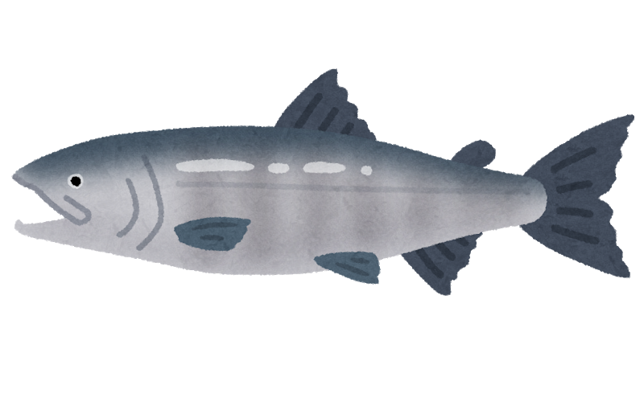
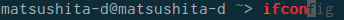
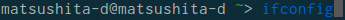
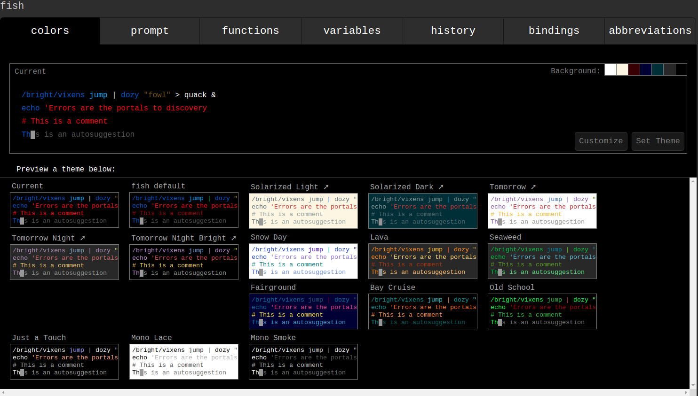
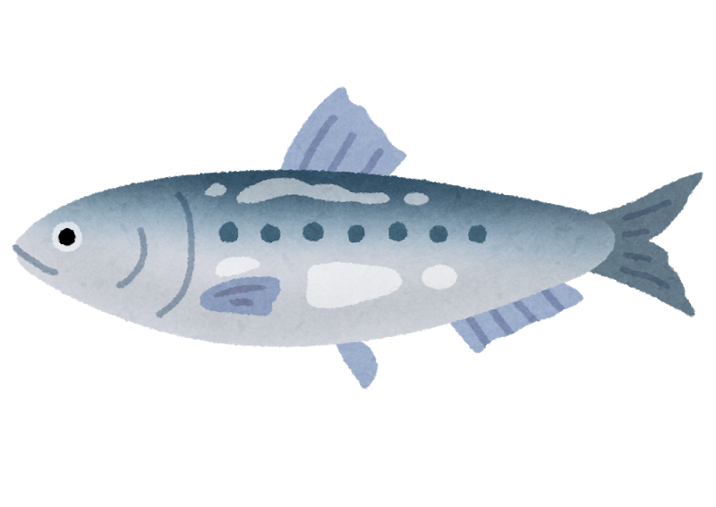

## Lightning Puzzle発表
===

###### 4830
###### 松下大祐

---

### goで書いてみた
- クロージャが使えるらしい

```go
package main

import (
	"os"
	"strconv"
	"fmt"
)

func lucas() func() (int, int) {
	prev, next, count := 2, 1, 1
	return func() (int, int) {
		prev, next, count = next, prev+next, count+1
		return next, count
	}
}

func main() {
	args := os.Args
	num, _ := strconv.Atoi(args[1])

	if num <= 2 {
		fmt.Println(num)
	} else {
		f := lucas()
		for {
			n, c := f()
			if n > num || n < 0 {
				fmt.Println(c)
				break
			}
		}
	}
}
```

---

```sh
$ time ./count_lucas $(( 2 ** 63 - 1 ))
91
./count_lucas $(( 2 ** 63 - 1 ))  0.00s user 0.00s system 34% cpu 0.011 total
```
- 速いけど普通
- ネタ要素が少ない

---

### シェルで書こう
- シェルでの 2^63 - 1 の計算方法を調べていた
- count_lucas自体もシェルで書けばいいのでは？
- でも普通のシェルで書いても面白くないのでは？

---

### fishで書こう
- friendly interactive shellの略らしい
- ネタ被りしなさそう


---

### fishの特徴
- デフォルトで色々と補完が効く
  - 薄字で補完
  - 不正なコマンドのときは赤色など



---

- GUIでの設定
  - fish_configコマンドを実行するとブラウザで設定ページが表示される


---

- POSIX非互換
  - `HOGE="hoge"`みたいなことが出来ない
    - `set HOGE "hoge"`とやらなきゃいけないらしい
      - `-u`とか`-g`とか`-l`とかでスコープが設定出来る
  - `fi`とか`esac`とか書かなくても`end`でいい

---

### 書いてみた

```sh
#!/usr/bin/env fish

function lucas 
  set -g prev $argv[2]
  set -g next (math $argv[1] + $argv[2]) 
  set -g count (math $count + 1)
end

set input $argv[1]
set threshold 6440026026380244498

if test $input -ge $threshold
  echo 91
  exit
end

if test $input -le 2
  echo $input
else
  set -g prev 2
  set -g next 1
  set -g count 1 

  while true 
    lucas $prev $next
    if test $next -gt $input
      echo $count
      exit
    end
  end
end
```

---

### 感想
- fishで書いてもあまり面白くはならなかった


---

### おわり
- 参考
  - 全訳！fishシェル普及計画 http://fish.rubikitch.com/
  - reveal.js https://github.com/hakimel/reveal.js

